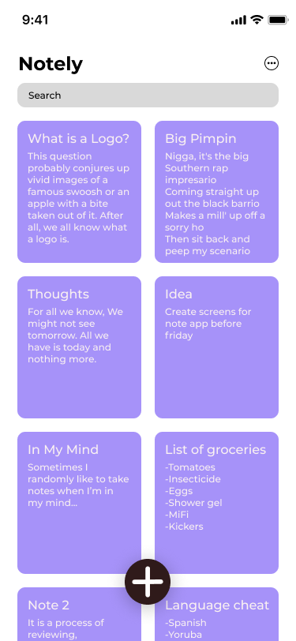
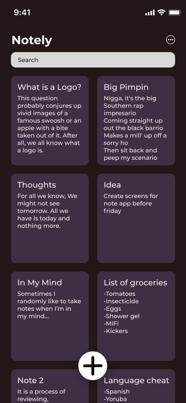
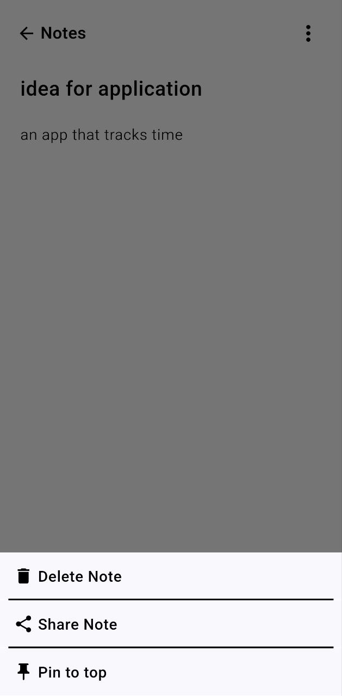
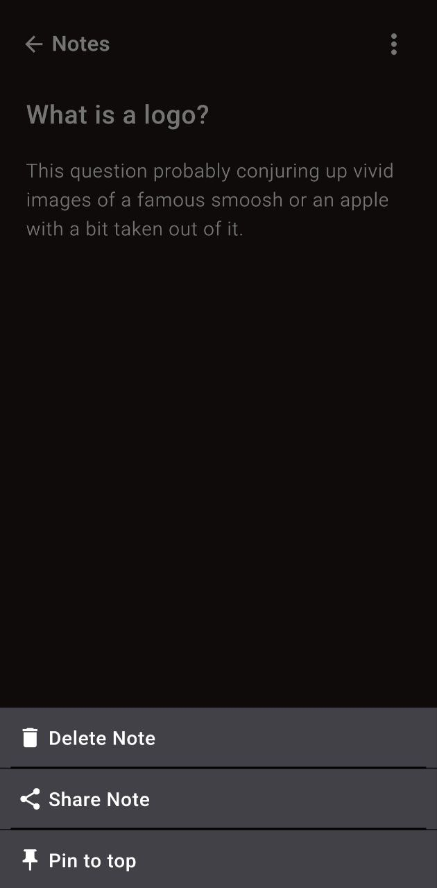

# Notely - A Flutter-based Note Taking App

Notely is an open-source, feature-rich note-taking application built using the Flutter framework. It allows users to create, view, edit, and manage their notes with ease.

## Features

- Create new notes with a title and description
- View and edit existing notes
- Pin important notes to the top
- Search for notes by title or description
- Dark mode support
- Share notes via various channels (e.g., email, messaging apps)
- Delete notes

## Screenshots

     

## Getting Started

To get started with Notely, follow these steps:

1. **Clone the repository**: